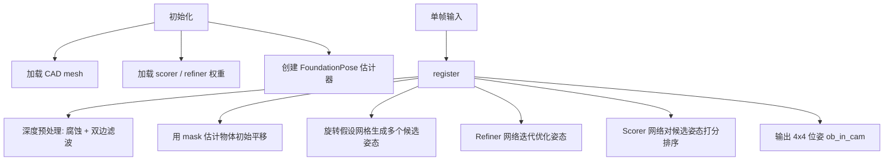

# FoundationPose 单帧推理流程与数据需求

基于 `run_demo.py` 和核心 `estimater.py` 的分析。

> **适用场景**：只做单帧 6D 位姿估计，不做视频流跟踪。只需调用一次 `register()`，无需 `track_one()`。

---

## 单帧推理流程

单帧推理走 **register** 路径，完整流程如下：




### register 内部核心步骤（`estimater.py`）

1. 深度预处理（腐蚀 + 双边滤波）
2. 校验 mask 与深度的有效重叠
3. 从旋转假设网格生成多个候选姿态，并用 mask 中心 + 深度中值估计初始平移
4. **Refiner** 网络迭代优化姿态（默认 5 次迭代）
5. **Scorer** 网络对候选姿态打分排序，选取最优
6. 返回 4×4 位姿矩阵 `ob_in_cam`（物体在相机坐标系下）

---

## 单帧推理需要哪些数据

### 1. 初始化（只需一次）


| 数据           | 说明                                                                          |
| ------------ | --------------------------------------------------------------------------- |
| **CAD 模型**   | `.obj` / `.stl` / `.ply` 等（`trimesh.load` 支持），需为**真实物理尺度（米）**               |
| **预训练权重**    | `weights/` 下的 refiner（`2023-10-28-18-33-37`）和 scorer（`2024-01-11-20-02-45`） |
| **CUDA GPU** | 推理在 GPU 上运行                                                                 |


### 2. 单帧 `register()` 输入


| 数据          | 格式要求                                   |
| ----------- | -------------------------------------- |
| **RGB**     | `(H, W, 3)`，`uint8`，RGB 顺序，值域 0–255    |
| **Depth**   | `(H, W)`，`float`，单位 **米（m）**，无效像素为 `0` |
| **K**       | `(3, 3)` 相机内参，**必须与 RGB/Depth 分辨率一致**  |
| **ob_mask** | `(H, W)` 二值 mask，目标物体像素为 `True/1`      |


单帧推理**不需要**上一帧位姿，也**不需要**视频序列。

---

## 现有数据能否直接推理？

若已有：**RGB + Depth + CAD + K**

**基本可以，但还缺 `ob_mask`，并需确认格式约束。**

### 还缺什么

**物体分割 mask（`ob_mask`）**

- 用于估计物体初始 3D 位置（mask 中心 + 深度中值）
- 用于过滤有效深度点
- 单帧推理同样**不可省略**

可用 SAM、Grounding DINO、手动标注或检测框填充等方式生成 mask。

### 必须满足的格式条件


| 检查项              | 要求                                   |
| ---------------- | ------------------------------------ |
| **深度单位**         | 必须是 **米**。若深度为 mm，需 `depth / 1000.0` |
| **RGB-Depth 对齐** | 同一相机、同一分辨率、像素对齐                      |
| **K 与分辨率匹配**     | K 的 fx, fy, cx, cy 对应实际图像尺寸          |
| **CAD 尺度**       | mesh 顶点坐标单位为米，与真实物体尺寸一致              |
| **深度有效性**        | 无效值设为 `0`；有效深度 `>= 0.001 m`          |
| **环境**           | CUDA + 权重 + `build_all.sh` 编译扩展      |


---

## 单帧推理代码示例

```python
import trimesh
import numpy as np
import cv2
from estimater import *

# ---------- 1. 初始化（只需一次）----------
mesh = trimesh.load("your_model.obj")
scorer = ScorePredictor()
refiner = PoseRefinePredictor()
glctx = dr.RasterizeCudaContext()
est = FoundationPose(
    model_pts=mesh.vertices,
    model_normals=mesh.vertex_normals,
    mesh=mesh,
    scorer=scorer,
    refiner=refiner,
    glctx=glctx,
)

# ---------- 2. 加载单帧数据 ----------
K = np.loadtxt("cam_K.txt").reshape(3, 3)          # (3,3) 内参
rgb = cv2.cvtColor(cv2.imread("rgb.png"), cv2.COLOR_BGR2RGB)  # (H,W,3) uint8
depth = cv2.imread("depth.png", -1).astype(np.float32) / 1000.0  # (H,W) 米，按实际单位调整
depth[(depth < 0.001)] = 0
mask = cv2.imread("mask.png", -1).astype(bool)     # (H,W) 物体区域

# ---------- 3. 单帧 register ----------
pose = est.register(
    K=K,
    rgb=rgb,
    depth=depth,
    ob_mask=mask,
    iteration=5,   # 精修迭代次数，默认 5
)

# pose: (4,4) 齐次变换矩阵，物体在相机坐标系下的位姿 (ob_in_cam)
np.savetxt("pose.txt", pose)
print(pose)
```

### 输出说明

- `pose` 为 4×4 齐次变换矩阵，表示 **物体坐标系 → 相机坐标系** 的变换
- 可直接用于可视化、抓取规划等下游任务

---

## 总结


| 阶段          | 需要的数据                         |
| ----------- | ----------------------------- |
| 初始化         | CAD mesh + 预训练权重 + GPU        |
| 单帧 register | RGB + Depth + K + **ob_mask** |


**结论**：单帧推理只需调用 `register()` 一次。所需输入为 **RGB + Depth + CAD + K + ob_mask**，其中 mask 是容易被忽略但必需的项。

---

## 附录：与视频跟踪的区别

FoundationPose 也支持视频流跟踪（`track_one()`），但单帧场景无需使用：


|       | 单帧 register                | 视频 track          |
| ----- | -------------------------- | ----------------- |
| 输入    | RGB + Depth + K + **mask** | RGB + Depth + K   |
| 依赖上一帧 | 否                          | 是（需先 register 首帧） |
| 网络    | Refiner + Scorer           | 仅 Refiner         |
| 速度    | 较慢（多候选姿态搜索）                | 较快（单姿态精修）         |


单帧场景忽略 `track_one()` 即可。