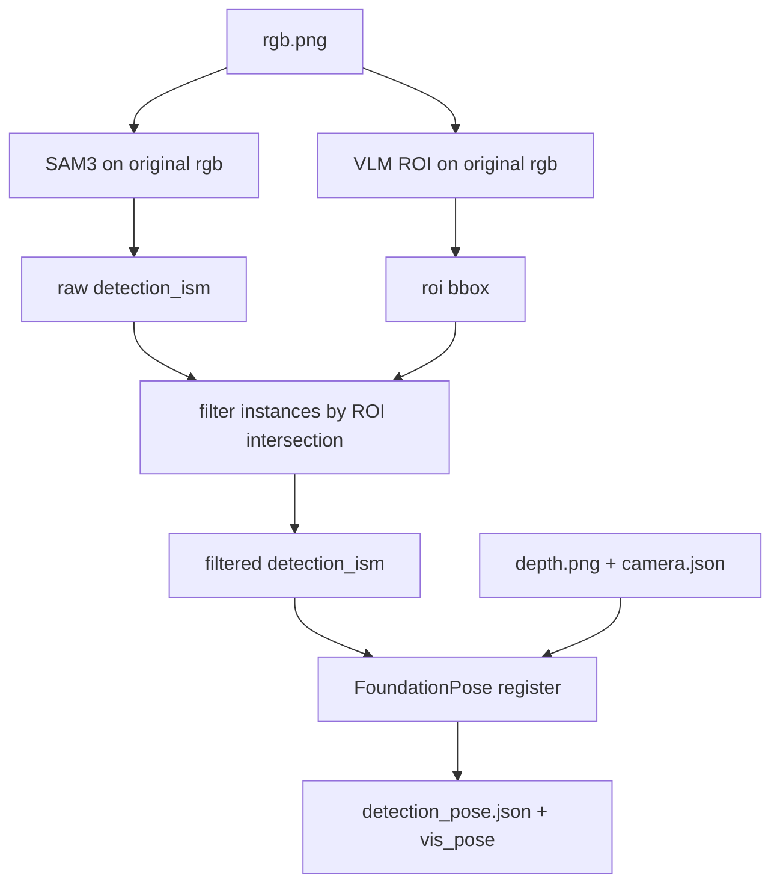

# VLM + SAM3 并行实例筛选方案（`vlm_seg`）

本文档描述新的分割与位姿检测流水线：

- `rgb` 原图一路送入 `SAM3`，直接得到 `instance masks`
- `rgb` 原图另一路送入 `VLM`，得到目标 `ROI`
- 用 `ROI` 对 `SAM3` 的实例结果做筛选
- **只有与 ROI 有交集的 instance** 才继续送入 `FoundationPose`

这份文档用于指导 `seg/vlm_seg.py` 与 `http_server.py` 的集成实现。

---

## 1. 背景与目标

### 1.1 现状问题

当前 `http_server.py` 直接对全图调用 SAM3 文本提示（如 `"Plastic Reel"`）：

```
rgb.png ──► sam3/scripts/infer.py ──► detection_ism.json ──► FoundationPose.register()
```

在多托盘、多相似白色料盘场景下，SAM3 往往会：

- 检出多个相似实例；
- 难以仅保留「蓝点上方那一盘」；
- 把货架、背景结构误检为候选。

### 1.2 新方案思路

新的方案不再对白图、裁剪图或 `new_image` 做任何处理，而是改为 **并行双分支**：

1. **SAM3 分支：** 直接在原始 `rgb` 上做实例分割；
2. **VLM 分支：** 在同一张原始 `rgb` 上做语义定位，输出单个目标 `ROI`；
3. **筛选阶段：** 用 `ROI` 判断每个 SAM3 instance 是否与目标区域有交集；
4. **位姿阶段：** 仅把保留下来的 instance 输出到 `FoundationPose`。

```
┌─────────────┐        ┌──────────────────┐
│  rgb (原图)  │───────►│ SAM3 → instances │──────┐
└─────────────┘        └──────────────────┘      │
       │                                         ▼
       │               ┌──────────────┐    ┌───────────────┐
       └──────────────►│ VLM → ROI    │───►│ ROI 交集筛选   │───► FoundationPose
                       │ (bbox_2d)    │    │ keep instances │
                       └──────────────┘    └───────────────┘
                                                        ▲
                                                        │
                                              depth / camera / 原图
```

### 1.3 与旧版方案的关键差异

| 项目 | 旧方案 | 新方案 |
|------|--------|--------|
| SAM3 输入 | `new_image`（ROI 外置白） | **原始 `rgb.png`** |
| VLM 的作用 | 先生成 ROI，再改图像内容 | **只生成 ROI，用于实例筛选** |
| 中间产物 | `rgb_vlm_masked.png` | **取消** |
| FoundationPose 输入 mask | SAM3 在白底图上的结果 | **SAM3 原图结果中，与 ROI 相交的实例** |

---

## 2. 流水线四步（需求定义）

| 步骤 | 输入 | 输出 | 负责模块 |
|------|------|------|----------|
| **① SAM3 实例分割** | 原图 `rgb` + SAM3 prompt | 原始 `detection_ism.json`、`vis_ism.png` | `seg/sam3_seg.py` |
| **② VLM ROI 定位** | 原图 `rgb` + VLM prompt | `bbox_2d`（像素或 0–1000 归一化） | `seg/VLM.py`（已有）→ 抽到 `vlm_seg.py` |
| **③ ROI 交集筛选** | 原始 `detection_ism.json` + `bbox_2d` | `filtered_detection_ism.json`、保留实例索引 | `seg/vlm_seg.py`（待实现） |
| **④ 位姿估计** | **原图** rgb/depth + **筛选后的** mask | `detection_pose.json`、`vis_pose.png` | `http_server.py` |

### 2.1 步骤 ① — SAM3 直接跑原图

**核心要求：** SAM3 仍然直接读取原始 `rgb.png`，不做白底、不裁剪、不缩放。

这一步与当前流程保持一致，包括但不限于：

- 仍调用 `seg/sam3_seg.py` 中的 `run_sam3_segmentation(...)`；
- 仍子进程执行 `sam3/scripts/infer.py`；
- 仍使用同样的 `--prompt`、`--threshold`、`--mask-threshold`、`--checkpoint` 等参数；
- 仍输出 `sam6d_results/detection_ism.json`、`vis_ism.png`、`mask_instances.png` 等。

**结论：** SAM3 侧逻辑不改，输入图也不改，保留现有全图实例分割能力。

### 2.2 步骤 ② — VLM 多模态 ROI

**目标：** 根据自然语言提示，返回 **至多 1 个** 目标框，用于在多托盘场景下指定目标区域，例如「蓝点正上方那一盘白托盘」。

**已有实现参考：** `seg/VLM.py`

- 通过 vLLM OpenAI 兼容接口调用 Qwen3-VL；
- 提示词要求输出 JSON 数组，例如：

```json
[{"bbox_2d": [x1, y1, x2, y2], "label": "white_tray_above_blue_dot"}]
```

- 坐标约定仍可使用 **0–1000 归一化**，再经 `bbox_to_pixel(bbox, W, H, mode="norm1000")` 转为像素；
- 无目标时返回 `[]`，流水线直接报错中止。

建议抽为可复用接口：

```python
@dataclass
class VlmRoiResult:
    bbox_pixel: tuple[int, int, int, int]
    label: str
    raw_response: str

def detect_vlm_roi(
    rgb_path: Path,
    *,
    prompt: str | None = None,
    api_url: str | None = None,
    model: str = "qwen3-vl-4b",
    timeout_s: float = 120.0,
) -> VlmRoiResult | None:
    ...
```

实现要点：

- 推理逻辑与可视化逻辑分离；
- `json.loads` 前允许 strip markdown 代码块；
- 返回前把 bbox `clip` 到图像范围内；
- 可选支持 `margin_px` 扩框，避免 VLM 框过紧导致正确实例被误过滤。

### 2.3 步骤 ③ — 用 ROI 对 SAM3 instances 做交集筛选

#### 2.3.1 筛选目标

给定：

- 一张原图上的 `SAM3` 实例分割结果；
- 同一张原图上的 `VLM ROI`；

需要保留所有 **与 ROI 有交集** 的 instance，并丢弃其它 instance。

这里的“交集”建议按 **mask 与 ROI 矩形区域的像素交集** 判断，而不是仅看 bbox 是否相交。原因是：

- SAM3 已经给出了实例 mask，直接用 mask 判断更准确；
- bbox 相交可能只是边缘擦到，不一定真的属于目标；
- mask 像素交集可以直接扩展出更严格的阈值规则。

#### 2.3.2 推荐判定规则

设：

- `roi_bbox = (x1, y1, x2, y2)`，来自 VLM；
- `roi_mask[y1:y2+1, x1:x2+1] = True`；
- `instance_mask` 为某个 SAM3 实例解码后的布尔掩码；

则交集像素数为：

```python
intersection_px = int(np.count_nonzero(instance_mask & roi_mask))
```

筛选规则：

- 当 `intersection_px >= 1` 时，认为该实例与 ROI 有交集，**保留**；
- 当 `intersection_px == 0` 时，认为不属于目标区域，**丢弃**。

如后续需要更严格过滤，可扩展为：

- `intersection_px >= min_intersection_px`
- 或 `intersection_px / instance_area >= min_intersection_ratio`

但当前需求按照“**只要有交集就保留**”执行即可。

#### 2.3.3 推荐实现

```python
@dataclass
class FilteredInstancesResult:
    filtered_detection_json: Path
    kept_instance_ids: list[int]
    kept_count: int

def filter_instances_by_roi_intersection(
    detection_ism_path: Path,
    image_size: tuple[int, int],  # (W, H)
    roi_bbox: tuple[int, int, int, int],
    *,
    min_intersection_px: int = 1,
) -> FilteredInstancesResult:
    """
    解码 detection_ism.json 中每个 instance mask，
    仅保留与 roi_bbox 对应矩形区域有像素交集的实例。
    """
    ...
```

推荐输出：

- `results/detection_ism_raw.json`：SAM3 原始结果的拷贝；
- `results/detection_ism_filtered.json`：仅保留与 ROI 相交实例的结果；
- `results/vlm_roi.json`：记录 ROI、本次保留的实例索引、交集像素数；
- `results/vis_filtered_ism.png`：可选，可视化筛选后实例叠加到原图。

#### 2.3.4 筛选阶段的职责边界

- **VLM：** 负责“指定目标区域”；
- **SAM3：** 负责“产出候选实例”；
- **ROI 筛选：** 负责“从候选实例中留下目标区域内的实例”。

也就是说，本方案不是让 VLM 直接替代 SAM3 分割，而是让 VLM 只承担 **目标选择** 的角色。

### 2.4 步骤 ④ — FoundationPose 位姿估计

**目标：** 与现网逻辑一致，但只对“筛选后的实例”做位姿估计。

**已有实现：** `http_server._run_foundationpose_pipeline()` 中的 `est.register(K, rgb, depth, ob_mask, ...)`

关键约束：

| 数据 | 使用内容 |
|------|----------|
| `rgb`（register 输入） | **原始** `rgb.png` |
| `depth` | **原始** `depth.png` |
| `ob_mask` | **筛选后的** `detection_ism.json` 解码得到的实例 mask |
| `K` | `camera.json` 的 `cam_K` |

注意：

- 本方案 **不修改** `rgb`、`depth`、`camera.json`；
- ROI 只参与 instance 筛选，不改变像素坐标系；
- SAM3 与 VLM 都基于同一张原图，因此不需要做 mask 坐标映射。

---

## 3. 目标模块 `seg/vlm_seg.py`（待实现）

建议提供统一入口，负责串联：

1. 原图跑 SAM3
2. 原图跑 VLM
3. 按 ROI 过滤实例
4. 返回“可直接给 `http_server` 使用”的筛选结果

参考接口：

```python
@dataclass
class VlmSam3FilterResult:
    vlm_bbox: tuple[int, int, int, int]
    sam3: Sam3SegmentationResult
    filtered_detection_json: Path
    kept_instance_ids: list[int]

def run_vlm_sam3_filter_pipeline(
    rgb_path: Path,
    output_dir: Path,
    *,
    vlm_prompt: str | None = None,
    sam3_prompt: str | None = None,
    skip_vlm: bool = False,  # 回退：等同直接 SAM3 全图
) -> VlmSam3FilterResult:
    """
    ① run_sam3_segmentation(rgb_path)
    ② detect_vlm_roi(rgb_path)
    ③ filter_instances_by_roi_intersection(...)
    """
```

推荐依赖关系：

```text
vlm_seg.py
  ├── seg.VLM 或抽出的 detect_vlm_roi()
  └── seg.sam3_seg.run_sam3_segmentation
```

伪代码示意：

```python
sam3_result = run_sam3_segmentation(rgb_path, output_dir, ...)
vlm_roi = detect_vlm_roi(rgb_path, ...)
filtered = filter_instances_by_roi_intersection(
    sam3_result.detection_ism_path,
    image_size=(W, H),
    roi_bbox=vlm_roi.bbox_pixel,
)
return VlmSam3FilterResult(
    vlm_bbox=vlm_roi.bbox_pixel,
    sam3=sam3_result,
    filtered_detection_json=filtered.filtered_detection_json,
    kept_instance_ids=filtered.kept_instance_ids,
)
```

---

## 4. `http_server.py` 集成点

在 `_run_foundationpose_pipeline()` 中，当前主流程是：

```python
sam3_result = run_sam3_segmentation(rgb_path, output_dir, ...)
```

建议替换为：

```python
use_vlm = os.environ.get("GENPOSE2_USE_VLM_ROI_FILTER", "1").strip() not in ("0", "false", "no")

if use_vlm:
    from seg.vlm_seg import run_vlm_sam3_filter_pipeline

    vlm_filtered = run_vlm_sam3_filter_pipeline(
        rgb_path,
        output_dir,
        vlm_prompt=...,
        sam3_prompt=...,
    )
    detection_ism_path = vlm_filtered.filtered_detection_json
    timing["vlm_s"] = ...
    timing["instance_filter_s"] = ...
else:
    sam3_result = run_sam3_segmentation(rgb_path, output_dir, ...)
    detection_ism_path = sam3_result.detection_ism_path
```

后续 `register` 循环的核心逻辑不变，只是实例来源从：

- 原来的 `SAM3 原始 detection_ism.json`

改为：

- `ROI 筛选后的 detection_ism_filtered.json`

建议额外写入 `results/vlm_roi.json`：

```json
{
  "bbox_pixel": [120, 80, 340, 520],
  "label": "white_tray_above_blue_dot",
  "kept_instance_ids": [1],
  "intersection_pixels": {
    "1": 8423
  }
}
```

---

## 5. 配置与环境变量

| 变量 | 含义 | 默认 |
|------|------|------|
| `GENPOSE2_USE_VLM_ROI_FILTER` | 是否启用 VLM ROI 筛选 | `1` |
| `GENPOSE2_VLM_API_URL` | vLLM chat completions URL | `http://192.168.100.92:8000/v1/chat/completions` |
| `GENPOSE2_VLM_MODEL` | served model name | `qwen3-vl-4b` |
| `GENPOSE2_VLM_PROMPT` | 覆盖 `VLM.py` 内 prompt | 文件内默认 |
| `GENPOSE2_VLM_ROI_MARGIN_PX` | VLM bbox 四向扩边像素 | `10` |
| `GENPOSE2_VLM_MIN_INTERSECTION_PX` | 实例与 ROI 的最小交集像素数 | `1` |
| `GENPOSE2_SAM3_PROMPT` | SAM3 文本提示 | `Plastic Reel` |
| `GENPOSE2_SAM3_MAX_INSTANCES` | SAM3 最多实例数 | `0`（不限制） |

说明：

- 新方案下，`GENPOSE2_SAM3_MAX_INSTANCES` **不建议再因为 VLM 而强制设为 `1`**；
- 因为目标选择由 ROI 交集筛选完成，SAM3 可以先尽量保留候选实例，再由后处理过滤。

---

## 6. 输出目录约定

在 `service_outputs/<request_id>/` 下建议：

```text
inputs/
  rgb.png
  depth.png
  camera.json
results/
  vlm_roi.json                   # VLM ROI 元数据 + 交集统计
  vlm_roi_vis.png                # 原图 + ROI 框（可选）
  detection_ism_raw.json         # SAM3 原始实例结果
  detection_ism_filtered.json    # 仅保留与 ROI 相交的实例
  vis_ism_raw.png                # 原始 SAM3 可视化（可选）
  vis_filtered_ism.png           # 筛选后实例可视化（可选）
  detection_pose.json
  vis_pose.png
sam6d_results/
  detection_ism.json
  vis_ism.png
  mask_instances.png
```

明确取消的旧产物：

- `inputs/rgb_vlm_masked.png`
- 任何基于 ROI 外置白生成的 `new_image`

---

## 7. 错误处理

| 情况 | 行为 |
|------|------|
| VLM 服务不可达 / 连接失败 | **`RuntimeError`** |
| VLM HTTP 非 200 | **`RuntimeError`** |
| VLM 返回 `[]` 或 JSON 解析失败 | **`RuntimeError`** |
| ROI 面积过小（如 < 100 px²） | 视为无效 ROI，**`RuntimeError`** |
| SAM3 无实例 | 与现逻辑一致：`RuntimeError("SAM3 returned no instances")` |
| SAM3 有实例，但无任何实例与 ROI 相交 | **`RuntimeError("No SAM3 instances intersect VLM ROI")`** |
| bbox 超出图像 | `clip` 到 `[0, W-1]`、`[0, H-1]` 后再参与筛选 |

仅当 `GENPOSE2_USE_VLM_ROI_FILTER=0` 或 `skip_vlm=True` 时，才跳过 VLM ROI 筛选、直接使用原始 SAM3 结果。

---

## 8. 开发任务清单（建议顺序）

1. **重构 `seg/VLM.py`**
   - 抽出 `detect_vlm_roi()`；
   - 环境变量读取 URL / model / prompt；
   - CLI `__main__` 仅用于单图调试。

2. **实现 `seg/vlm_seg.py`**
   - `filter_instances_by_roi_intersection()`
   - `run_vlm_sam3_filter_pipeline()`
   - 写出 `vlm_roi.json` 与 `detection_ism_filtered.json`

3. **改 `http_server.py`**
   - 开关 `GENPOSE2_USE_VLM_ROI_FILTER`
   - `timing["vlm_s"]`、`timing["instance_filter_s"]`
   - `register` 阶段读取筛选后的 `detection_ism.json`

4. **测试**
   - 单图：`test/multi-tray/dc330a18ba4206ce4fe80f16e1288240.jpg`
   - 流水线：`test/run_local_infer.py --sample-dir test/20260522_121946`
   - 对比：开/关 ROI 筛选时的 `detection_pose.json` 与 `vis_pose.png`

5. **文档**
   - 更新 `test/README.md` 中的 VLM 依赖、env、结果文件说明。

---

## 9. 测试与验收标准

**单元：**

- 给定固定 `roi_bbox` 与多个 mock `instance_mask`，只有有交集的实例被保留；
- `bbox_to_pixel([0,0,1000,1000], W, H)` 覆盖整图；
- `GENPOSE2_VLM_ROI_MARGIN_PX` 生效后，边缘接触实例不会被误删。

**集成：**

- VLM 在多托盘图上稳定输出 1 个 bbox；
- SAM3 在原图上可输出多个候选实例；
- `detection_ism_filtered.json` 中只保留与 ROI 相交的实例；
- FoundationPose 输出的 3D 框投影到原图后，与目标托盘对齐；
- 关闭 `GENPOSE2_USE_VLM_ROI_FILTER=0` 时，行为与改动前一致。

---

## 10. 与现有文件对照

| 文件 | 角色 |
|------|------|
| `seg/VLM.py` | 步骤 ② 参考实现（需抽 API） |
| `seg/sam3_seg.py` | 步骤 ① 子进程封装 |
| `seg/vlm_seg.py` | **待实现**，串联 VLM ROI 与实例筛选 |
| `http_server.py` | 步骤 ④ 总编排与 FoundationPose 调用 |
| `sam3/scripts/infer.py` | SAM3 推理后端 |

---

## 11. 流程图（Mermaid）



---

## 12. 注意事项

1. **不再生成白底图。** 任何 `new_image`、`rgb_vlm_masked.png`、ROI 外置白逻辑都应移除。
2. **SAM3 必须继续读原图。** 不允许因为 VLM ROI 而改 SAM3 输入坐标系。
3. **不要修改 depth。** 位姿阶段仍使用原始深度与原始相机内参。
4. **ROI 只用于筛选，不用于裁剪。** 当前需求是“有交集就保留”，不是“只在 ROI 内重新分割”。
5. **交集判断优先基于 mask。** 若仅看 bbox，容易保留误检实例。
6. **VLM temperature** 建议降到 `0.0–0.3`，减少 bbox 抖动。
7. **多实例是允许的。** 只要与 ROI 有交集，就都可以继续送入 `FoundationPose`；如业务需要单实例，可在后续规则中再做收敛。

---

*文档版本：已按“`rgb -> SAM3 -> instance` + `rgb -> VLM -> ROI` + `ROI 筛选 instance`”的新方案更新。*
